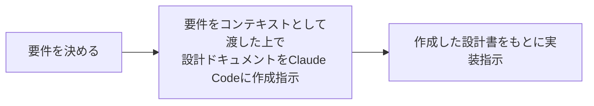

## はじめに

カンリー SRE チームの有村です！

開発者から「作業で必要だから、一時的に強い権限が欲しい」という依頼を受けた際に、Slack 上の申請から権限付与・自動失効までを一気通貫で実行できるシステムを、Claude Code を活用して内製しました。

本記事では、このシステムを OSS ではなく内製で開発するに至るまでのプロセス、どのような構成で実装したのか、Claude Codeを用いた社内システム開発の技法について紹介します。

## 背景

これまでカンリー SRE チームでは、開発メンバーの AWS権限付与を手動で行っていましたが、このやり方には以下の課題がありました。

- **権限の「付与しっぱなし」が起きやすい**：剥奪漏れによって、権限が累積していくセキュリティリスク
- **トイル化**：付与/剥奪作業が SRE のリソースを圧迫し、信頼性改善などのコア業務を圧迫
- **緊急時のリードタイム**：必要なタイミングで権限を出すフローが整っていないと、緊急時のオペレーションが遅延

これを仕組みで解決するため、本記事で紹介するシステムの開発に至りました。

## ゴール

開発メンバーの AWS アクセスが、以下を満たす状態を目指しました。

- **業務に必要と認められる範囲の権限**が
- **必要なタイミング**で
- **適切な対象者**に
- **必要と認められる期間に限り** 付与され、期限後は自動で剥奪される
- 申請・付与・剥奪の **履歴が追跡でき、棚卸し** できる

## なぜ OSS利用ではなく内製したのか

わざわざ内製せずとも目的を満たすOSSが存在しており、当初は IAM の一時権限管理に関する OSS [TEAM](https://aws.amazon.com/jp/builders-flash/202505/temporary-elevated-access-management/) の活用を検討していました。

しかし以下の理由から、内製での開発を選びました。

### 1. 運用面での懸念

- 想定利用者は社内の業務委託・正社員に限定されているが、OSSのツールでは大規模・マルチテナント向けの要件が設定されており、提供される機能が必要以上に多い
  - プロビジョニングされるAWSリソースの数が多く、運用・金銭的なコストが掛かる
- 不具合が起きた際はOSSのアップデートを待つかコミットする必要がある
- 社内の要望に合わせて柔軟にカスタマイズしづらい

### 2. シンプルな要件である

今回のゴールを満たす上で以下の要件を設定しました。

- Slack から申請フォーム経由で受け付ける
- 承認者が承認/拒否する
- IAM Identity Center API で一時的に Permission Set を割り当てる
- 有効期限が来たら自動で剥奪する
- CloudTrailなどで申請の履歴が把握できる

この要件であれば、AWSのサーバレスサービスを組み合わせただけで実装できそうな内容だと判断しました。

### 3. Claude Code 活用により高速な実装が可能

カンリーではClaude Codeの活用を積極的に推進しており、これを活用すればシンプルな要件の社内システムであれば **少ない工数で実装できる** と判断できました。

上記の理由から「Claude Codeを活用し、0から内製で開発を進める」という方向性に決まりました 🎉

## システム概要

アーキテクチャは以下のような **サーバーレス構成** に決定しました。

### 主要コンポーネント

| リソース | 用途 |
| --- | --- |
| Slack App | 申請・通知インターフェイス（Slash Command + Modal + Interactive Components） |
| API Gateway (HTTP API) | Slack からのリクエスト受信エンドポイント |
| Lambda × 4 | 申請受付 / 承認処理 / 権限削除 / 手動取消 |
| DynamoDB | 申請レコード・チーム設定・Slack User ↔ チームマッピングを管理。TTL を期限管理に利用 |
| EventBridge Pipes | DynamoDB Streams → Lambda の連携。TTL 削除イベントだけをフィルタ |
| Secrets Manager | Slack Bot Token / Signing Secret の管理 |
| IAM Identity Center | 既存の Permission Sets を再利用して権限を付与 |

💰 ランニングコストは小規模利用なら **月あたり数百円** で収まる試算です。

## 主要フロー

### 1. 申請

申請者は Slack で `/aws-access` を実行し、Modal で以下を入力します。

- 対象 AWS アカウント（所属チームに紐づくアカウントのみ動的表示）
- 要求する Permission Set（IAM Identity Center 登録済みのものから選択）
- 申請理由
- 有効期限
- 承認者

申請レコードは DynamoDB に `status: PENDING` で保存され、承認者の DM に承認/拒否ボタン付きのメッセージが届きます。

### 2. 承認

承認者が「承認」を押すと、Lambda が以下を実行します。

1. DynamoDB のステータスを **条件付き書き込み** で `APPROVED` に更新（二重承認防止）
2. IAM Identity Center の `CreateAccountAssignment` を実行
3. DynamoDB の TTL 属性に有効期限を Unix timestamp で設定
4. 申請者に Slack で完了通知

### 3. 自動失効

`DynamoDB TTL → DynamoDB Streams → EventBridge Pipes → Lambda` のパイプラインで、TTL による削除イベントを検知し、`DeleteAccountAssignment` API を叩いて権限を剥奪します。

EventBridge Pipes の **フィルタリングで TTL 削除イベントだけを対象** にしている点がポイントで、通常の Put/Update イベントは Lambda を起動しないため、コストとノイズを最小化できています。

### 4. 手動取り消し

「やっぱり権限を取り消したい」「期限内に権限が必要なくなった」というケース向けに、`/aws-revoke` コマンドも用意しました。申請者本人または承認者のみが操作可能で、`status: REVOKED` として記録され、自動失効（`EXPIRED`）と区別できるようにしています。

---

以上が今回内製したシステムの全体像です。次に、これを Claude Code でどのように構築していったかを振り返ります。

## Claude Code を使った開発の振り返り

Claude Codeを利用してシステムを内製する上で、以下の流れで実装を進めました。

### 設計面

「Slack Appとサーバレス構成 (Lambda)を組み合わせてIAM Identity Centerで一時権限発行をする」といった何となくの構成は設計の初期段階で見えていた部分ですが、「自動失効をどう実現するか？」「申請の履歴を追跡可能にするには？」といった細かい検討部分がいくつかありました。

一つ一つ検討していく上で公式ドキュメントを読み込んだり、リスクなどを事前に洗い出したりなど人力だと時間のかかる作業ですが、Claude Codeに実施させた上でアイデアとメリット・デメリットを出力させることで、スムーズに設計を終えることができました。

### 実装面

設計書が完成したら、それをコンテキストとして渡してやれば基本的にスムーズに実装が進みました。

実際動かしてみて想定通りに動かなかったり、セキュリティ面などのリスクも考えられることから、実装させるだけではなく、実装内容のレビューもClaude Codeに実施させ、適宜修正することで一定の品質を担保することができました。

## まとめ

AWS アカウントへのアクセス権限の運用について、適切に管理する仕組みを導入しようとすると、サードパーティ製のツールを導入するか、一定の工数を割いて内製するか迷うところですが、AIの台頭によって少ない工数で社内向けシステムを内製開発することに対するハードルが下がったように思えます。

今回は AWS の一時権限付与運用の最適化を事例として挙げましたが、他にもちょっとした社内の課題解決をClaude CodeなどのAIツールを用いて設計から実装まで比較的容易に実施できるかと思います。

AWS IAMに関するソリューションやAIを用いた内製開発の考え方について、少しでもこの記事が皆様のお役に立てれば幸いです。
